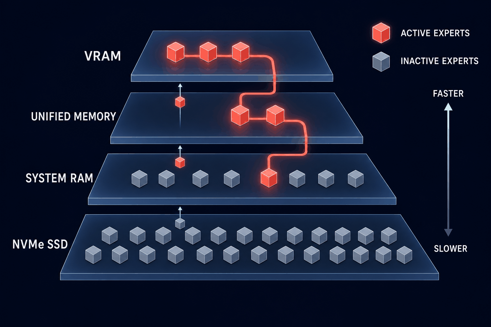
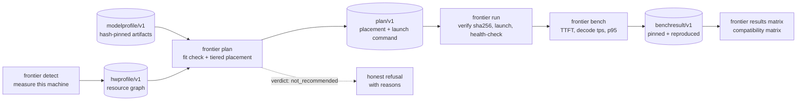
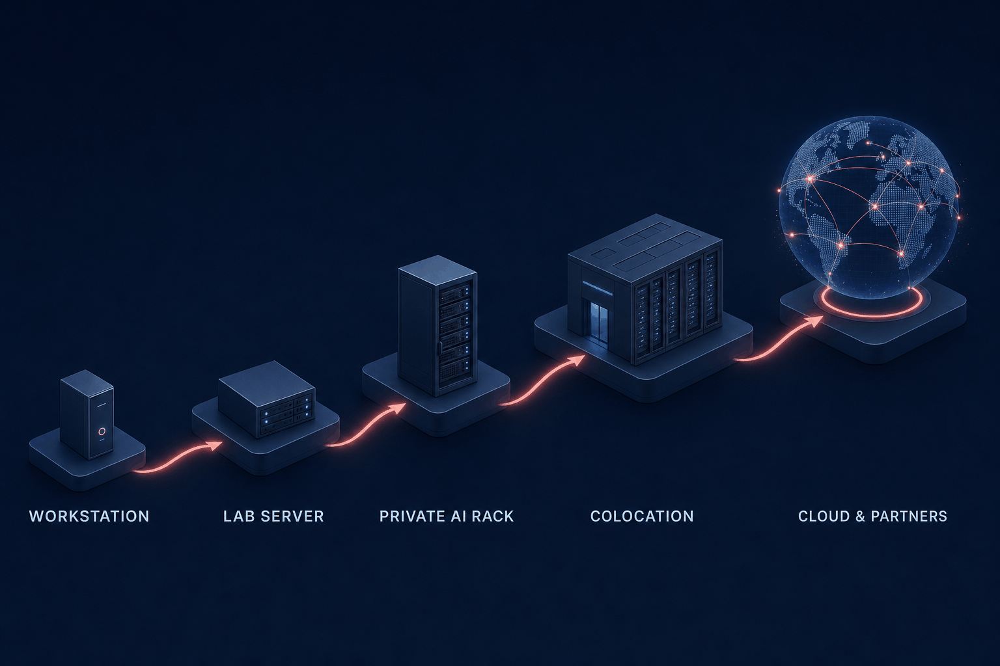
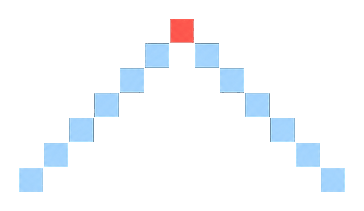

<div align="center">


# Frontier Bridge

**Memory-hierarchy planning for giant MoE models on hardware you already own.**

Profile the machine. Plan the tiers. Get a launch command — or an honest refusal.

<br/>

[](https://github.com/Brianletort/Frontier-Bridge/actions/workflows/ci.yml)
[](LICENSE)
[](pyproject.toml)
[](rfcs/0001-resource-graph-schemas.md)

`v0.1-dev` — first verified row landed 2026-07-05: a 284B MoE running agent-capable on a single workstation, reproduced 2x ([matrix](#compatibility-matrix) · [roadmap](docs/roadmap.md))

[Quickstart](#quickstart) · [Demo](#demo) · [How it works](#how-it-works) · [Architecture](docs/architecture.md) · [Status](#status) · [Honest limits](#honest-limits) · [Matrix](#compatibility-matrix) · [FAQ](docs/faq.md) · [Contributing](#contributing)

</div>

---

Can a single high-end machine run frontier-scale open models — GLM-5.2 (744B total / 40B active, upstream claims), DeepSeek V4 class — if VRAM, unified memory, system RAM, and fast NVMe are planned as one hierarchy? That is the question this project exists to measure. Today it ships the schemas and planning CLI: profile hardware → plan the tiers → get a launch command or an honest refusal. Verified usability rows are the work in progress.

## Quickstart

```bash
git clone https://github.com/Brianletort/Frontier-Bridge.git
cd Frontier-Bridge
pip install -e ".[dev]"

# profile this machine (hardware_profiles/local/ is gitignored)
frontier detect -o hardware_profiles/local/my_machine.yaml
PROFILE=$(awk '/^profile_id:/{print $2}' hardware_profiles/local/my_machine.yaml)

frontier catalog models                # what's pinned: GLM-5.2, DeepSeek V4 Flash
frontier plan deepseek-v4-flash --quant q2_imatrix \
    --hardware "$PROFILE" --workload coding_agent --ctx 32768
```

No supported detect path for your OS yet? `frontier catalog hardware` lists committed reference profiles (`rtx6000_96gb_64ram`, `gb10_128gb`, `m5_max_128gb`) you can plan against immediately.

## Demo

The loop below is the real CLI on the M5 Max — recorded with [VHS](docs/demo.tape), reproducible from the committed tape. The full YAML these commands produce is in [See it work](#see-it-work):

<div align="center">

</div>

`detect` and `plan` run in seconds with nothing downloaded. The full loop — download a pinned GGUF, `frontier run`, `frontier bench`, reproduce twice, fold into the matrix — is the [benchmark playbook](docs/benchmark_playbook.md). Model artifacts are 107–467 GB; the planner tells you *before* you download whether your machine is worth the bandwidth. (On Apple Silicon the planner defaults to the ds4 engine; pass `--engine llama_cpp` if that's what you have installed.)

## See it work

Profile → plan → refusal, on real hardware — an M5 Max, sold as 128 GB (GiB), which `detect` measures as 137.4 decimal GB of unified memory. These are schema and planning outputs, not benchmark-verified results; usability ratings wait for the benchmark pipeline, per the [results-integrity rule](GOVERNANCE.md#results-integrity).

**1. Profile the machine.** `frontier detect` measures what it can and records `null` for the rest — no spec-sheet guessing:

```yaml
profile_id: apple_m5_max_137gb_detected
nodes:
- id: unified0
  kind: memory
  class: unified
  capacity_gb: 137.4
- id: ssd0
  kind: storage
  class: internal_ssd
  measured:
    seq_read_gbps: 14.22          # measured on this machine, not quoted
    bench_tool: frontier-detect python bounded read (512MB, uncached, qd1)
```

**2. Plan a model.**

```bash
frontier plan deepseek-v4-flash --quant q2_imatrix --engine llama_cpp \
    --hardware apple_m5_max_137gb_detected --workload coding_agent --ctx 32768
```

Planner output, not a benchmark-verified result (shown with llama.cpp; ds4 is the default engine on Apple Silicon). `recommended` means a measured memory fit with headroom, not proven usability — and the `l2` tier is overflow topology, present even when the artifact fits resident:

```yaml
verdict: recommended
placement:
  resident: { dense_core: unified0, router: unified0, shared_experts: unified0 }
  tiered:
    routed_experts:
      l0: { node: unified0, budget_gb: 116.9, policy: layer_aware_lru }
      l2: { node: ssd0, mode: stream_on_miss }
phases:
  prefill: { notes: throughput-bound; expert misses tolerable }
  decode:  { prefetch: static_hotlist, notes: miss-sensitive; protect the active path }
runtime:
  engine: llama_cpp
  launch: llama-server -m <GGUF_PATH> -c 32768 --host 127.0.0.1 --port 8080 -ngl 999
risks:
- agent_workloads_are_decode_latency_sensitive
```

**3. Get refused when the numbers don't work.** Ask for more context than the model supports and the planner will not pretend:

```yaml
# frontier plan glm-5.2 --hardware rtx6000_96gb_64ram --workload long_context --ctx 2000000
verdict: not_recommended
reasons:
- 'context_budget_exceeds_claimed_max: 2000000 > 1048576'
```

That refusal is the product working as designed. A planner you can trust when it says *yes* is one that says *no* out loud.

## How it works

Sparse MoE is the working hypothesis. A 744B-total model activates ~40B parameters per token (upstream claims) — so the question worth testing is not "does 744B fit in memory" but "**can the active path stay fast while inactive experts tier across RAM and SSD?**" That is a planning problem, and it is the problem this project works on.

<div align="center">

</div>

Everything is a graph of resources and links, **measured where possible, `null` where not — never assumed**. A hardware profile has no hardcoded `vram/ram/ssd` fields — it has memory, compute, storage, and network *nodes* joined by *links* with measured bandwidth. An RTX 6000 box, a GB10 with coherent unified memory, and a Mac Studio are the same schema with different topology. So is a multi-GPU rack node — which is what makes scaling up a schema change, not a rewrite. Design details in [RFC 0001](rfcs/0001-resource-graph-schemas.md).



Frontier Bridge is **not another inference runtime**. Plans emit exact launch commands for llama.cpp, ds4 (an SSD-expert-streaming runtime for Apple Metal), MLX, vLLM, and SGLang — launch-command wrappers today, not deep integrations; TensorRT-LLM and KTransformers are planned ([adapter status](runtime_adapters/README.md)) — and the harness measures the result. Prefill and decode are planned separately from day one: prefill is throughput-bound and tolerates expert-cache misses; decode is miss-sensitive and gets latency targets and prefetch policy of its own. Protecting the interactive path is where usefulness lives.

Want the long read — the planner's decision path, the worked worst-case streaming math, topology diagrams for all three reference machines? [docs/architecture.md](docs/architecture.md).

## Status

The measurement pipeline is built and tested; the first verified rows are the current milestone ([roadmap](docs/roadmap.md)). What works today:

| Capability | State |
|---|---|
| Four versioned schemas (`hwprofile`, `modelprofile`, `plan`, `benchresult` — [RFC 0001](rfcs/0001-resource-graph-schemas.md)) | Ratified, frozen at v1 (additive only) |
| `frontier detect` | Live on macOS/Apple Silicon; Linux/NVIDIA + WSL2 + GB10 unified-memory paths written and fixture-tested, pending real hardware |
| Pinned model artifacts | GLM-5.2 Q2/Q4 routed and DeepSeek V4 Flash Q2/Q4 imatrix: sha256 per shard |
| `frontier catalog inspect-gguf` | Measures dense vs routed-expert splits from GGUF headers via range requests — no full download |
| `frontier plan` (rules-based planner v0) | Measured memory model, tiered placement with expert-capacity counts, streaming worst-case math, graceful refusal |
| `frontier run` / `frontier bench` | sha256 verification, runtime launch, health-check; TTFT / decode tps / p50-p95-p99, four prompt suites → `benchresult/v1` |
| `frontier results matrix` | Folds committed results into the compatibility matrix |
| CI | GitHub Actions: pytest + schema validation on Linux and macOS |

**Next:** benchmark the three reference machines ([playbook](docs/benchmark_playbook.md)), publish the first verified rows, tag v0.1.0, then the CUDA SSD expert-streaming spike ([protocol](docs/spike_cuda_expert_streaming.md)) targeting the RTX 6000 96 GB class. Full phased plan: [docs/roadmap.md](docs/roadmap.md).

## Honest limits

- We do not make any frontier model run on consumer hardware. The goal is to make the best possible use of available infrastructure — turning models from impossible into runnable, and from runnable into useful, is the hypothesis the benchmarks exist to test.
- Every number in this repo carries its provenance: **measured** applies to hardware telemetry we ran ourselves, **claimed** to upstream model metadata, and **verified** only to benchmark rows backed by pinned hashes and two reproductions ([GOVERNANCE.md](GOVERNANCE.md)). Anything we can't support is `null` — we never guess.

More hard questions — SSD endurance, Q2 quality, why a data center company sponsors this — get straight answers in the [FAQ](docs/faq.md).

## Compatibility matrix

The v0.1 targets: **GLM-5.2** (Q2/Q4 routed GGUF) and **DeepSeek V4 Flash** (Q2/Q4 imatrix GGUF) across four hardware classes. Usability ratings, in order: `unrated → runs → usable → interactive → agent_capable`, plus `not_recommended` as a first-class result. No row moves past `unrated` until a hash-pinned `benchresult/v1` file backs it, reproduced twice. Context ranges are targets, not results:

| Hardware | Model | Quant | Mode | Context (target) | Status |
|---|---|---|---|---|---|
| M5 Max 137 GB (measured) | DeepSeek V4 Flash | Q2_K-XL | Metal + CPU-MoE offload | 8K measured | **verified — interactive (chat), agent_capable (coding)**: 7.4 tps decode, p95 168 ms, reproduced 2x |
| RTX 6000 96 GB / 64 GB RAM | GLM-5.2 | Q2 routed | VRAM+RAM+SSD | 32K–128K | unrated (target) |
| GB10 128 GB | GLM-5.2 | Q2/Q4 routed | unified+SSD | 32K–128K | unrated (target) |
| M5 Max 128 GB | GLM-5.2 | Q4 GGUF | Metal+SSD | 32K | unrated (target) |
| RTX 5090 32 GB + 128 GB RAM | *(community profile wanted)* | — | hybrid VRAM/RAM | — | open gap |
| Strix Halo 128 GB | *(community profile wanted)* | — | unified+SSD | — | open gap |

First verified rows landed 2026-07-05: a 284B-parameter MoE running as a usable coding agent on a single Apple workstation, every number pinned and reproduced twice ([results/verified/](results/verified/)).

Additional MoE families (Qwen, MiniMax, Kimi, and newer GLM/DeepSeek releases) follow the same profile format. The live scoreboard — generated from committed `benchresult/v1` files, never hand-edited — is [docs/compatibility_matrix.md](docs/compatibility_matrix.md).

## Vision

The operating thesis is simple: **build the base, rent the spike.** Own the infrastructure for your steady-state AI workloads — a workstation, a lab server, a private rack — and rent cloud capacity for the peaks. Frontier Bridge makes the base side of that equation credible: measured proof of what hardware you own can actually run.

**AI runs across a continuum of infrastructure** — laptops, workstations, lab servers, private racks, colocation, and hyperscale platforms — and the aim is for the most capable open models to be practical at every rung someone can afford. Because the same resource-graph schema describes a workstation and a rack node, the project's profiles, plans, and benchmarks carry across that whole range. Full mission and strategy: [MISSION.md](MISSION.md); the upward path is sketched in [docs/enterprise_bridge.md](docs/enterprise_bridge.md).

<div align="center">

</div>

**Goals (v0.1).** Verified benchmark rows for GLM-5.2 and DeepSeek V4 Flash on three reference machines — RTX 6000 96 GB, GB10 128 GB, M5 Max 128 GB — and an open schema standard anyone can submit results against.

**Principles** (from [MISSION.md](MISSION.md)):

1. **Credibility before code.** Honest limits and refusal behavior matter more than early features.
2. **Measurement before optimization.** Nothing is *verified* without pinned hashes and two reproductions.
3. **Open standard before novel kernels.** The schemas and benchmark format are the durable contribution.
4. **Not another runtime.** We generate exact launch commands for existing engines and measure the result.

## Sponsorship

Frontier Bridge is sponsored by [Digital Realty](https://www.digitalrealty.com/). Sponsorship does not change how technical decisions are made — the [results-integrity rule](GOVERNANCE.md#results-integrity) applies equally to sponsored and community contributions. See [NOTICE](NOTICE) and [GOVERNANCE.md](GOVERNANCE.md).

## Contributing

The most valuable early contributions are **hardware profiles from machines we don't have** (RTX 5090 + 128 GB DDR and Strix Halo are open gaps) and **benchmark results that reproduce**. Start with [CONTRIBUTING.md](CONTRIBUTING.md); the results-integrity rule is in [GOVERNANCE.md](GOVERNANCE.md). Issue templates exist for [volunteering a profile](https://github.com/Brianletort/Frontier-Bridge/issues/new?template=good_first_profile.md) and [reporting hardware quirks](https://github.com/Brianletort/Frontier-Bridge/issues/new?template=hardware_quirk.md), and [Discussions](https://github.com/Brianletort/Frontier-Bridge/discussions) is open — first thread: which machine should we profile next?

```text
schemas/              JSON Schema files for the four v1 schemas
rfcs/                 design RFCs (schemas are ratified here)
hardware_profiles/    committed hwprofile/v1 YAML (detected or manual provenance)
model_profiles/       committed modelprofile/v1 YAML per model/quant
plans/                example plan/v1 outputs
results/              benchmark results (community and maintainer-verified)
runtime_adapters/     per-runtime adapter status
docs/                 roadmap, playbooks, enterprise bridge, launch checklist
src/frontier_bridge/  the CLI and library
tests/                pytest suite
```

## License

Apache 2.0. See [LICENSE](LICENSE), [NOTICE](NOTICE), and [IP_NOTICE.md](IP_NOTICE.md).

<div align="center">
<br/>

</div>
