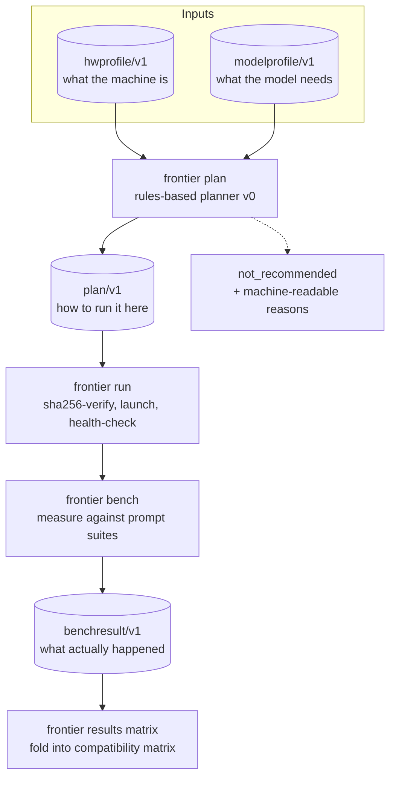
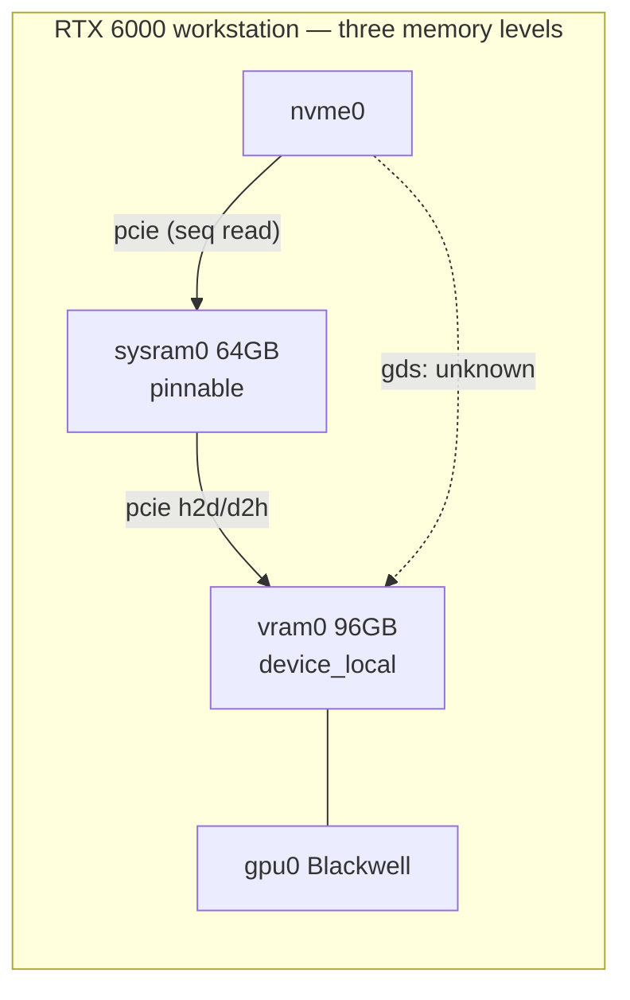
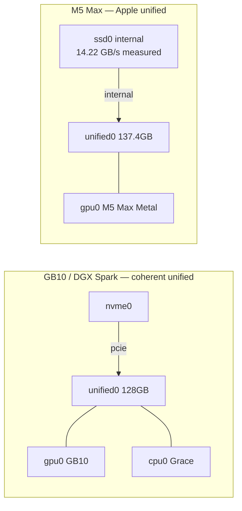
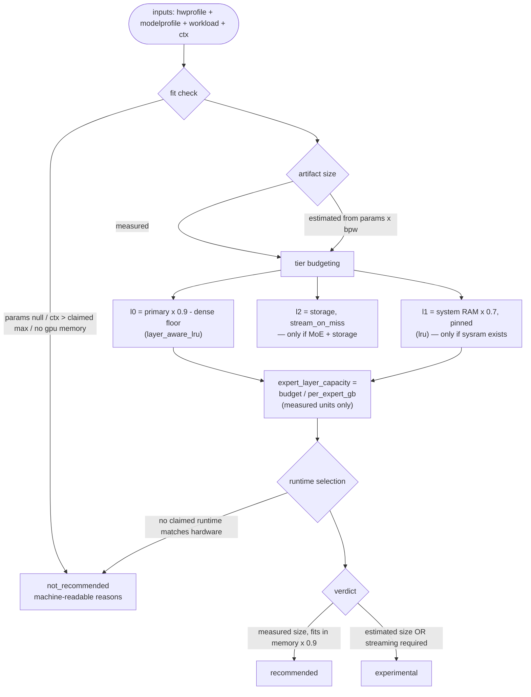
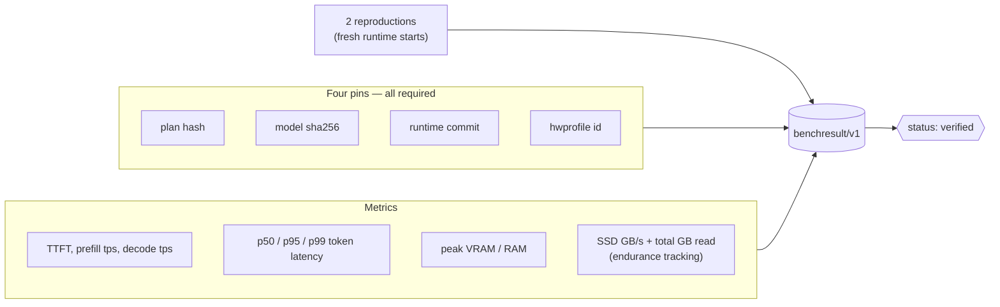

# Architecture — The Long Read

The [README](../README.md) is built to scan; this document is built to understand. It walks the four schemas, the planner's decision path, the streaming math that motivates the whole project, and the anatomy of a verified result. Everything cites real files in this repo — where numbers appear, they come from committed profiles, not prose.

## The core idea in one diagram

Frontier Bridge treats a machine as a **graph of resources and links** and a model as a **set of behavioral traits**, then plans the intersection. Nothing in the pipeline is a runtime; every stage emits a versioned, validated document ([RFC 0001](../rfcs/0001-resource-graph-schemas.md)):



## One schema, three machine shapes

A hardware profile has no `vram/ram/ssd` fields. It has **nodes** (compute, memory, storage, network) and **links** (interconnects with measured bandwidth). That is what lets three very different machines — the v0.1 reference fleet — share one schema and one planner:





The RTX box has a three-level hierarchy where the NVMe → pinned-RAM → VRAM chain is the constraint that matters. The GB10 and M5 Max collapse VRAM and RAM into a single `unified` node — the planner sees the different topology and emits two tiers instead of three. Compare [hardware_profiles/rtx6000_96gb_64ram.yaml](../hardware_profiles/rtx6000_96gb_64ram.yaml) with [hardware_profiles/apple_m5_max_137gb_detected.yaml](../hardware_profiles/apple_m5_max_137gb_detected.yaml): same schema, different graphs.

Two provenance rules govern every field ([RFC 0001](../rfcs/0001-resource-graph-schemas.md), design principles):

1. **Measured wins; never guess.** Rated and measured values live in separate fields; unknowns are `null` or `unknown`, never invented. The M5 Max profile records its SSD at 14.22 GB/s because `frontier detect` benchmarked it; the manual RTX profile records `null` until the machine is detected for real.
2. **Claimed vs verified.** Upstream facts (parameter counts, context windows, runtime support) enter as `claimed` and only become `verified` behind a hash-pinned, twice-reproduced benchmark.

## What a model profile knows

A `modelprofile/v1` is not a spec sheet — it is the set of traits the planner schedules on ([model_profiles/glm_5_2/q2_routed.yaml](../model_profiles/glm_5_2/q2_routed.yaml)):

| Trait | GLM-5.2 example | Why the planner cares |
|---|---|---|
| `type: moe`, 744B total / 40B active | 256 routed experts, 8 active per token | MoE + storage = streaming is possible at all |
| `dense_resident_gb: 15.7` (measured) | from GGUF header offsets via `frontier catalog inspect-gguf` | the floor that must stay in fast memory |
| `per_expert_gb: 0.011` (measured) | one (expert, layer) slice at Q2 | converts tier budgets into expert capacities |
| `routed_experts_gb: 222.87` (measured) | total routed weight | derives the MoE layer count for streaming math |
| artifacts + per-shard sha256 | 6 shards pinned | `frontier run` verifies the hash before launching (bypassable with `--no-verify`, never for publishable runs) |
| `known_failure_modes` | `q2_quality_degradation_unquantified` | honesty travels with the profile |

The `inspect-gguf` trick is worth knowing: it reads dense-vs-expert tensor splits from GGUF headers using HTTP range requests — measuring a 239 GB artifact without downloading it.

## The planner's decision path

`frontier plan` is deliberately a rules engine, not ML — every decision is documented, and every heuristic it falls back on is disclosed in the plan itself ([src/frontier_bridge/planner/engine.py](../src/frontier_bridge/planner/engine.py)):



Three properties matter more than the individual rules:

- **Refusal is a first-class output.** Missing parameter counts, over-claimed context, no GPU-class memory, no matching runtime — each produces `verdict: not_recommended` with machine-readable reasons, not a hopeful plan.
- **Estimates are quarantined.** When artifact size is unmeasured, the planner estimates from parameter count and bits-per-weight — but the plan is then capped at `experimental` and carries a `model_size_estimated_from_param_count_not_measured` risk. `recommended` requires measured numbers.
- **Expert capacities are computed only from measured units.** `expert_layer_capacity` appears only when `per_expert_gb` was measured from GGUF headers; otherwise it is `null`, never approximated.

## The worst-case math: why locality is the entire game

The planner computes streaming feasibility from measured values only. For GLM-5.2 Q2 (all numbers from the committed profile):

```text
per (expert, layer) slice      0.011 GB        measured from GGUF headers
routed experts total           222.87 GB       measured
MoE layers                     222.87 / (0.011 x 256) ~= 79
active experts per token       8               upstream claim

worst case (every activation misses, streams from storage):
  8 experts x 79 layers x 0.011 GB  ~=  6.95 GB per token

on a 7 GB/s NVMe (illustrative — the RTX box's drive is unmeasured until
detect runs on it)             ~1.0 s per token   (~1 token/s)
on the M5 Max SSD (14.22 GB/s, measured) ~0.49 s per token  (~2 tokens/s)
```

That worst case is unusable — and that is precisely the point. The entire question is how far *expert locality* moves you off the worst case: if the hot experts for your workload fit in the l0/l1 tiers, misses become rare and decode stays interactive. Whether real workloads (coding agents, long context) exhibit enough locality is an empirical question, and it is exactly what the [CUDA expert-streaming spike](spike_cuda_expert_streaming.md) measures on the RTX 6000: trace real router decisions, compute hit rates for LRU/LFU/static-hotlist caches at various sizes, and only then decide whether an explicit cache is worth building. The decision rule is written down before the experiment: adopt only at ≥1.5x decode tps or ≥2x p95 over the tuned mmap baseline.

When a plan requires streaming, the same math appears in the plan itself under `expected.streaming`, including `worst_case_miss_seconds_per_token` computed against the machine's *measured* SSD bandwidth — or a `streaming_cost_not_computable_missing_measured_expert_sizes` risk when the inputs are not measured.

## Prefill and decode are different problems

Every plan carries independent phase policies:

| Phase | Bound by | Expert misses | Policy |
|---|---|---|---|
| Prefill | throughput | tolerable — batching hides latency | `batch: auto` |
| Decode | latency | the enemy — each miss stalls the token loop | prefetch policy + p95 targets, `protect the active path` |

This distinction is the difference between a model that *runs* and a model that is *usable*. A configuration can score fine on prefill-heavy summarization and be hopeless as a coding agent; the plan schema encodes that physics from day one, and agent-class workloads automatically carry an `agent_workloads_are_decode_latency_sensitive` risk.

## Anatomy of a verified result

`benchresult/v1` is the trust mechanism. One JSON file per run:



No pins, no verified. One reproduction, no verified. The tool enforces the pins and the reproduction count — `frontier bench` emits `status: claimed` otherwise — while fresh-runtime-start discipline for reproductions is enforced in review per the [benchmark playbook](benchmark_playbook.md). The [compatibility matrix](compatibility_matrix.md) is a fold over these files, not a database anyone can edit. `ssd_total_read_gb` is tracked per run so the "won't streaming wear out my SSD?" question gets answered with data ([FAQ](faq.md)).

## Where this goes

The resource-graph design is why the [enterprise bridge](enterprise_bridge.md) is a schema change, not a rewrite: a multi-GPU rack node is more nodes and links; a multi-site deployment is a network link with measured bandwidth. The planner does not care whether `l1` is pinned workstation RAM or a CXL pool — it cares about capacity and measured bandwidth. Next steps, gates, and sequencing live in the [roadmap](roadmap.md).
