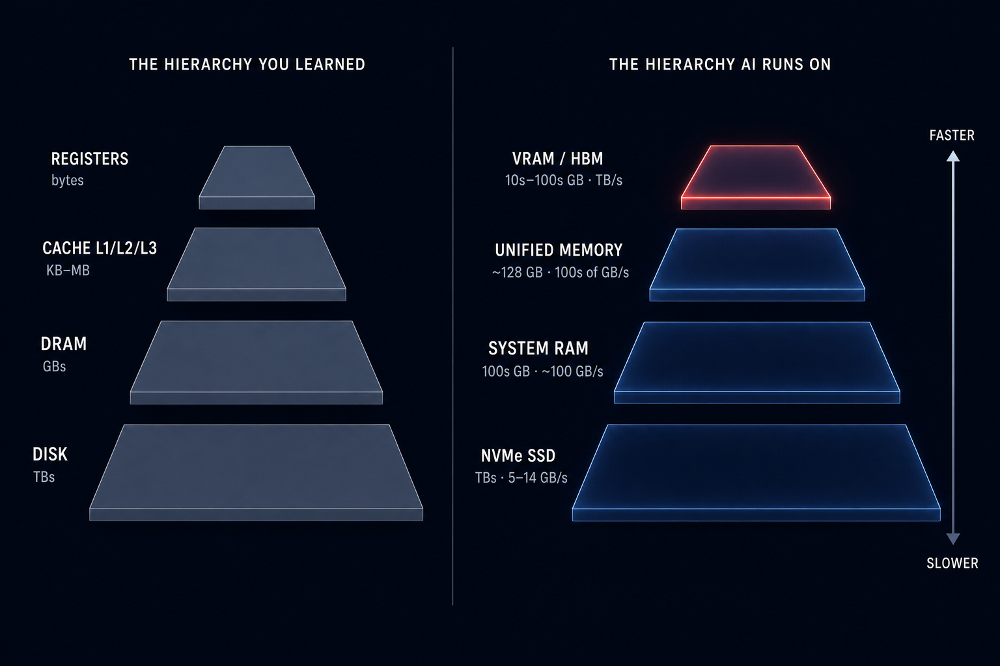

# The New Memory Hierarchy

Every computer-organization course teaches the same pyramid: registers at the top, then L1/L2/L3 cache, then DRAM, then disk — each level bigger, slower, and cheaper per byte than the one above it. The pyramid works because of two things the student learns next: **locality** makes small fast levels effective, and **the hardware manages it for you** — cache controllers and the OS page system move the right bytes without the programmer thinking about it.

Frontier-scale AI inference has quietly rebuilt that pyramid, several orders of magnitude larger at every level — and this time, nothing manages it for you.

## The same shape, new physics

| Dimension | Classic hierarchy | AI inference hierarchy |
|---|---|---|
| Levels | Registers → L1/L2/L3 → DRAM → disk | VRAM/HBM → unified memory → system RAM → NVMe SSD |
| Level sizes | bytes → KB–MB → GBs → TBs | 10s–100s GB → ~128 GB → 100s GB → TBs |
| Unit managed | Cache line (64 B), page (4 KB) | Expert slice (0.011 GB measured for GLM-5.2 Q2), KV block, layer |
| Source of locality | Program loop structure | Router decisions — expert locality, workload-dependent |
| Who manages it | Hardware + OS, transparently | **Nobody, by default.** It must be planned |
| Miss penalty | Nanoseconds to microseconds | Milliseconds per expert miss, stalling the decode loop |
| Shape | Fixed — the same pyramid on every machine | Varies per machine — unified memory collapses two levels |

Bandwidth ranges in the diagram are typical for current hardware, except one: the M5 Max internal SSD at 14.22 GB/s is a measured value from a committed profile ([hardware_profiles/apple_m5_max_137gb_detected.yaml](../hardware_profiles/apple_m5_max_137gb_detected.yaml)) — per this project's rule, measured numbers are labeled as such and everything else is a range, never a guess.

## Why the unit of management changed

The classic hierarchy moves cache lines and pages because programs touch memory in small strides. Sparse MoE models changed the unit: for GLM-5.2 Q2, the natural block is one (expert, layer) slice — **0.011 GB, measured from GGUF headers** ([model_profiles/glm_5_2/q2_routed.yaml](../model_profiles/glm_5_2/q2_routed.yaml)). That is roughly 170,000x a 64-byte cache line. A 744B-total model activates ~40B parameters per token (upstream claims), so most of the model is cold most of the time — exactly the property that makes a hierarchy worth having.

## Why locality is now an open question

Classic locality comes from loops: the hardware could bet on the next cache line because programs are predictable. In MoE inference, locality comes from **router decisions** — which experts fire for which tokens — and that is workload-dependent and largely unmeasured. Whether a coding-agent workload keeps a hot set of experts small enough to pin in fast memory is an empirical question, and it is the question the [CUDA expert-streaming spike](spike_cuda_expert_streaming.md) exists to answer with traced router decisions and cache-hit-rate curves.

The stakes are quantified in [architecture.md](architecture.md): if every activation misses to storage, GLM-5.2 Q2 streams ~6.95 GB per token — about one token per second on a typical NVMe drive. Unusable. The entire game is how far real expert locality moves you off that worst case.

## Why nobody manages it — and what fills the gap

There is no cache controller between VRAM and system RAM, and no page system that understands "these 8 experts out of 256 are hot for this workload." Runtimes each handle slices of the problem with different assumptions (`-ngl`, `--n-cpu-moe`, mmap behavior, expert offload flags), but nothing owns the placement decision across the whole hierarchy.

That is the gap Frontier Bridge fills. The planner is, in effect, the missing cache controller — except it runs ahead of time and shows its work:

- The machine is a **resource graph** ([RFC 0001](../rfcs/0001-resource-graph-schemas.md)): memory, compute, storage, and network nodes joined by links with measured bandwidth. This is why the varying shape of the new hierarchy is not a problem — an RTX 6000 box with three levels (VRAM → pinned RAM → NVMe) and an M5 Max with two (unified → SSD) are the same schema with different topology.
- Tier budgets convert into **expert capacities** using measured per-expert sizes — computed only when the inputs were measured, `null` otherwise.
- Prefill and decode get **separate policies**, because prefill tolerates misses and decode does not — the phase distinction is where usability lives.
- When the numbers cannot work, the output is a **refusal with reasons**, not a hopeful plan.

## Slotting new hardware into the hierarchy

The hierarchy people actually own keeps growing sideways: Thunderbolt/USB4 external SSDs, eGPU enclosures, NAS boxes, LAN-attached machines. [RFC 0002](../rfcs/0002-normalized-tiers-external-resources.md) ratifies how they slot in without special cases:

> **A tier is a bandwidth class, not a device category.** The planner sorts every reachable capacity pool by its measured effective bandwidth to the compute node doing decode, and the tiers fall out. Devices earn their tier by what they measure, not by what they are.

That rule produces some usefully counterintuitive placements:

- A **Thunderbolt external SSD** (~3–6 GB/s through the tunnel) slots *below* the M5 Max's internal SSD (14.22 GB/s measured) — "external storage" is not automatically the bottom tier, but it isn't automatically useful either.
- An **eGPU** is not a storage tier at all. Its VRAM is fast locally but sits behind a ~4 GB/s link, so streaming experts across it per token can lose to the internal SSD. The planner places it as a **resident island**: a fixed expert subset lives there permanently and is computed where it lives.
- A **NAS** earns its rank from the wire: 10GbE (~1.2 GB/s) lands at the bottom; 100GbE (~12 GB/s) can outrank local SATA.

When link bandwidths are unmeasured, tiers are ordered by documented class priors and the plan discloses it (`tier_order_uses_class_priors_where_links_unmeasured`) — priors order tiers, but they never produce numbers.

The long-form treatment — the planner's decision path, the worked streaming math, topology diagrams for the reference machines — is in [architecture.md](architecture.md). A reproducible version of the hierarchy figures, generated from the committed profiles rather than drawn by hand, is in [notebooks/memory_hierarchy.ipynb](../notebooks/memory_hierarchy.ipynb).
